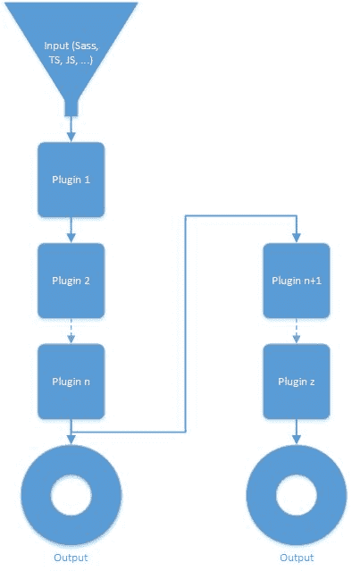

## 四个 API 来统治它们

Gulp 使您可以轻松上手，因为它只提供了四种 API 功能，您可以使用它们执行大量的魔术。

那么，让我们来看看这四个 API 函数以及它们提供的功能。

### gulp.src（）

随着。 src（）函数，您可以使用直接路径加载一个或多个文件，也可以使用 node-glob 语法。后者超出了本书的范围，但你可以在这里阅读 [](https://github.com/isaacs/node-glob) 。

### gulp.dest（）

在完成插件流并执行各自的任务之后，您可能希望在某些输出中获得那么辛苦的工作结果。使用 dest（）函数，您可以这样做，并将输出写入磁盘。

dest（）函数发出传递给它的所有数据。这意味着它可以在需要时写入多个文件夹。甚至可以编写流的结果，然后继续使用该结果并在其上应用其他插件。

代码清单 1

```
gulp.src('./client/templates/*.jade')

  .pipe(jade())

  .pipe(gulp.dest('./build/templates'))

  .pipe(minify())

  .pipe(gulp.dest('./build/minified_templates'));

```

在示例代码中，您可以看到通过 .src（）函数，正在加载文件，然后通过管道传输到插件和目标中的流。正在处理这些文件并将其写入 ./build/templates ，然后将它们缩小为另一个插件，并将其结果写入 ./build/minified_templates 。

可以在下图中看到这种可视化：



图 2：具有多个目的地的吞咽流量