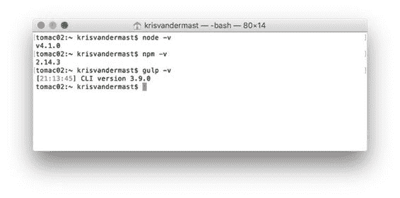

# 第 2 章让我们建立一些东西

## 安装 Gulp

如第 1 章所述，Gulp 是一个在 node.js 之上运行的任务运行器。因此要让 Gulp 运行，我们需要安装 node.js.您可以在此处下载  。随之而来的是 Node Package Manager，或者是 npm。在本书的其余部分中，您将使用 npm 来安装所需的 Gulp 插件。稍后会详细介绍。

安装 node.js 后，需要打开控制台窗口或终端窗口并输入以下内容：

npm install --global gulp

这将全局安装 Gulp 并将 Gulp 添加到您计算机的路径上。

|  | 提示：如果您未在 Mac 上以管理员权限运行，则需要在此命令前加上 sudo 。所以它成为 sudo npm install --global gulp 。 |

前面的步骤只需要在每台要使用 Gulp 的机器上执行一次。

完成这些步骤后，您可以输入以下命令来检查是否已设置好所有步骤。

节点-v
npm -v
gulp -v

这将为您提供每个组件的版本。当我写这个段落时，你在下一个图中看到的版本可以在我的机器上找到。当您阅读本文时，版本号可能已经更改。

图 3：显示 node.js，npm 和 Gulp CLI 的版本