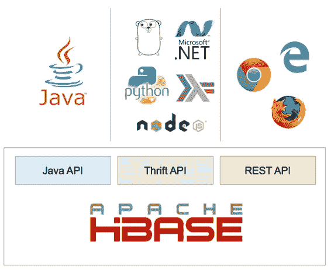
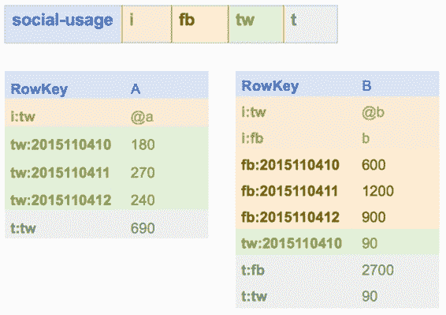

# 第 1 章 HBase 介绍

## 什么是 HBase？

HBase 是一个 NoSQL 数据库，可以在单个机器或服务器集群上运行，以实现性能和容错。它是为规模构建的 - HBase 表可以存储数十亿行和数百万列 - 但与其他面向批处理的大数据技术不同，HBase 可以实时提供数据访问。

有一些关键概念使 HBase 与其他数据库不同，在本书中我们将学习关于行键结构，列族和区域的所有信息。但 HBase 使用与其他数据库设计相同的基本概念，因此可以直接提取它。

HBase 是 Apache Foundation 提供的免费开源软件。它是一种跨平台技术，因此您可以在 Windows，Linux 或 OS / X 计算机上运行它，并且在 Amazon Web Services 和 Microsoft Azure 中都可以在云中托管 HBase 解决方案。在本书中，我们将使用 Docker 容器中所有运行 HBase 的最简单选项。

您可以使用许多客户端选项连接到 HBase，如图 1 所示.Java API 是一等公民，但使用 Thrift 和 REST API，您几乎可以使用任何语言和平台进行连接。我们将介绍本书中的所有三个 API，以及 HBase 附带的命令行界面。



图 1：HBase API 和客户端平台

## 为什么选择 HBase？

HBase 是一个非常灵活和强大的数据库，它集成了广泛的技术并支持许多不同的用例。 HBase 利用 Hadoop 分布式文件系统实现存储层的高可用性，但提供了实时接口，因此它对事务系统和大数据问题都很有用。

在生产系统中，HBase 比许多数据库具有更复杂的基础结构要求 - 有三个服务器角色（Zookeeper，主服务器和区域服务器），并且为了可靠性和性能，每个角色需要多个节点。使用设计良好的数据库，您只需添加更多服务器即可扩展 HBase，您永远不需要存档旧数据。

HBase 是一个 Java 系统，可以在开发和测试环境的简化模式下运行，因此您的非生产环境可以适度。您可以对数据库进行容器化，这样可以在构建过程中轻松进行端到端测试，并为您的代码提供高水平的质量保证。

## HBase 数据结构

HBase 的灵感来自 Google 的 Big Table，后者是用于索引网络的存储技术。该架构满足了对具有 TB 级甚至数 PB 级数据的数据库中特定项目的实时随机访问的需求。在具有数亿行的 HBase 表中，您仍然可以期望对各行进行亚秒级访问。

HBase 中的表格部分结构化;它们没有像 SQL 数据库那样严格的模式，其中每列都有数据类型，但它们确实具有松散的模式，其中定义了数据的一般结构。在 HBase 中，您可以根据列族来定义表，该列可以包含许多列。

在 HBase 中，表是类似数据的集合，表包含行。每一行都有一个唯一的标识符 - 行键 - 以及为表定义的列族中的零个或多个列。列族是动态的，因此包含数据的实际列可能因行而异。

## 样品 HBase 表

表 2 显示了名为社交用法的 HBase 表的模式，该表记录了人们在社交网络上花费的时间。结构非常简单，只包含一个表名和一个列族名列表，这些都是 HBase 的需求：

表 1：HBase 中的表结构

| 表名 | 社会使用率 |
| 列族 | 一世 |
|  | FB |
|  | TW |
|  | Ť |

该表将为每个用户记录一行，并且列族具有神秘的名称。列名是每行存储和传输的数据的一部分，因此通常它们保持很短。

这是列族用于：

· i =标识符，不同社交网络的用户 ID

· fb = Facebook，记录用户的 Facebook 活动

· tw = Twitter，记录用户的 Twitter 活动

· t =总数，用户活动总和

图 2 显示了此表的两个示例行，用于具有非常不同的使用情况的用户：



图 2：样本 HBase 行

我们可以从这两行看到 HBase 的强大功能，它从一个非常简单的表模式中告诉我们很多。用户 A 在左侧的行中有一个 Twitter 帐户并且使用它很多，但不在 Facebook 上。在右侧的行中，用户 B 拥有两个网络的帐户，但在 Facebook 上花费的时间要多得多。

## 列系列和限定符

列族就像哈希表或字典。对于每一行，列族可以包含许多值（称为单元格），这些值按名称键入（称为列限定符）。表中可用的列族是固定的，但您可以动态地向行中的列族添加或删除单元格。

这意味着列限定符可用作数据存储以及单元格值。在样本中的 fb 列族中，一行具有带限定符 fb：2015110410 的单元格，以及值 600 。 HBase 并不限制你如何命名限定符，所以在这种情况下我使用的日期是年，月，日，小时 - 单元格值记录该小时内的总使用量（以秒为单位）。

对于用户 B，Facebook 使用列系列告诉我们他们在 2015 年 11 月 4 日的 10:00 到 11:00 之间在 Facebook 上花费了 10 分钟（单元格值 600 秒），并且在 11 点之间 20 分钟：00 和 12:00。没有限定符 fb：2015110409 的单元格，它告诉我们用户在 09:00 到 10:00 之间不在 Facebook 上。

## HBase 表设计

HBase 非常灵活，但访问数据的主要方法是使用行键，因此表的设计对于解决方案的性能至关重要。在社交用法表中，我们为每个用户存储一行，并且对于每个报告周期，我们将向列族添加更多单元格。

这称为**宽表**设计 - 我们有一个（相对）少量的行，但行可能有很多列。如果我们记录每小时的使用情况，那么对于活跃用户，我们可以每周添加 98 个单元格（一周中每小时一个单元格）。几年之后，我们将为该用户的行提供数万个单元 - 这对于 HBase 来说不是一个问题，但是我们可能难以高效使用。

如果我们想要计算特定月份的用户活动，我们需要通过按列限定符名称过滤结果来读取行并包含该月的单元格。基于列的过滤对于 HBase 比基于行的过滤要昂贵得多，因此替代设计将是使用**高表**设计。

高大的表具有更多行，每行具有更少的列数。我们可以为每个用户的每个句点设置一行，而不是为每个用户分配一行，这将为我们提供图 3 中的数据：


图 3：高台设计

现在，该行包含用户名和句点，即数据的日期。列名要短得多，因为我们只捕获列名中的小时，并且行中的所有数据都是相同的日期。对于活跃用户，我们每行只有几十列，数百行可以记录一年的数据。

此设计使用复合行键，格式为`{userID} | {period}`，因此如果我们想要将用户的使用量相加一段时间，我们可以通过行扫描来实现，这比柱式过滤器便宜得多，我们稍后会看到这两种情况。

 注意：您需要设计 HBase 表以支持您期望的数据访问模式，但通常高表优于宽表。

代码清单 1 显示了用于创建社交用法表的数据定义语言（DDL）语句。它包含您需要的最小金额 - 表名，后跟列族名：

代码清单 1：创建 DDL 语句

```
create 'social-usage', 'i', 'fb', 'tw', 't'

```

HBase 中的模式定义是故意模糊的。未指定行键和列限定符的格式，并且没有数据类型。

使用该表的约定在模式中不明确，实际上我们可以对宽表使用完全相同的模式（仅使用行键的用户 ID）或高表（使用用户 ID 和句点）行键）。

## 数据类型

HBase 中没有数据类型;所有数据都存储为字节数组 - 单元格值，列限定符和行键。一些 HBase 客户端通过它们的接口传输它们;其他人抽象细节并将所有数据公开为字符串（因此客户端库对 HBase 中的字节数组进行编码和解码）。

代码清单 2 显示了社交用法表中的行如何通过 HBase Shell 访问它，后者将字节数组解码为字符串。代码清单 3 通过 REST API 显示相同的行，它将原始字节数组公开为 Base64 编码的字符串：

代码 2：使用 HBase Shell 读取数据

```
hbase(main):006:0> get 'social-usage', 'A|20151104'
COLUMN                CELL                                                     
 tw:10                timestamp=1447622316218, value=180                       
1 row(s) in 0.0380 seconds

```

代码 3：使用 REST API 读取数据

```
$ curl -H Accept:application/json http://127.0.0.1:8080/social-usage/A%7C20151104
{"Row":[{"key":"QXwyMDE1MTEwNA==","Cell":[{"column":"dHc6MTA=","timestamp":1447622316218,"$":"MTgw"}]}]}

```

请注意，行键必须在 REST 调用中进行 URL 编码，并且 JSON 响应中的所有数据字段都是 Base64 字符串。

如果您专门使用一个客户端，则可以使用平台的本机格式存储数据。代码清单 4 显示了如何将 Java 中的十进制值（1.1）保存到 HBase 中的单元格：

代码清单 4：在 HBase 中存储类型化数据

```
Put newLog = new Put(rowKey);
newLog.addColumn(family, qualifier, Bytes.toBytes(1.1));
access_logs.put(newLog); 

```

如果您使用许多客户端，这可能会导致问题，因为本机类型编码在不同平台上并不相同。如果您使用.NET 客户端读取该单元格，并尝试将字节数组解码为.NET 十进制值，则它可能与您在 Java 中保存的值不同。

 提示：如果您正在使用跨平台解决方案，最好将所有值编码为 UTF-8 字符串，以便任何客户端都可以解码 HBase 中的字节数组并获取同样的结果。

## 数据类型

我们将在本简介中介绍 HBase 的最后一个特性是可以对单元格值进行版本控制 - 每个值都使用 UNIX 时间戳存储，该时间戳记录上次更新的时间。您可以拥有具有相同行键和列限定符的单元格的多个版本，并且在该数据版本为当前时记录不同的时间戳。

HBase 客户端可以获取最新的单元版本，或最新的 X 版本，或特定日期的最新版本。更新单元格值时，可以指定时间戳或让 HBase 使用当前服务器时间。

HBase 存储的单元版本数量是在列族级别指定的，因此不同表中的不同族可以具有不同的设置。在最新版本的 HBase 中，默认版本数为 1，因此如果需要数据版本控制，则需要在 DDL 中明确指定。

对于单版本列系列，对单元的任何更新都会覆盖现有数据。对于多个版本，单元格值将像后进先出堆栈一样存储。当您读取单元格值时，您将获得最新版本，如果更新已具有最大版本数的单元格，则会删除最旧版本。

## 摘要

在本章中，我们概述了 HBase 是什么，它如何逻辑地存储数据，以及它提供的功能。在下一章中，我们将了解如何使用 HBase 的本地实例和 HBase Shell 启动和运行。