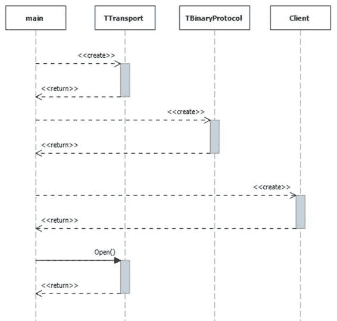

# 第 5 章用 Python 和 Thrift 连接

## 概述

HBase 非常适合跨平台解决方案，Thrift API 是 Java API 的替代品。 Thrift 是 Apache 的通用 API 接口，支持从不同语言到 Java 服务器的客户端连接。我们将在本章中使用 Python，但您可以使用 Thrift 绑定的任何语言（包括 Go，C# ，Haskell 和 Node）。

Thrift API 是一个外部接口，因此需要额外的 JVM 才能运行。您可以使用 HBase 守护程序脚本 hbase-daemon.sh start thrift 启动它。它可以单独托管到 HBase 集群的其余部分，也可以在 Region Servers 上运行。 Thrift 没有本机负载均衡器，但传输是 TCP，因此您可以使用外部负载均衡器（如 HAProxy）。

默认情况下，Thrift 服务器侦听端口 9090，它已经在 hbase-succinctly Docker 镜像上运行。

Thrift 比 REST 更轻量级，因此它可以提供更好的性能，但它不是那么用户友好。要使用 Thrift API，在大多数情况下，您需要从源代码构建 Thrift，从描述接口的公共 .thrift 文件生成对 API 的绑定，然后导入 Thrift 传输和绑定你的客户端应用。

 注意：Thrift API 记录在.thrift 文件中。该文件不附带 HBase 二进制文件，因此您需要从源中获取正确的版本。对于 1.1.2 版，该文件位于 GitHub [](https://github.com/apache/hbase/blob/cc2b70cf03e3378800661ec5cab11eb43fafe0fc/hbase-thrift/src/main/resources/org/apache/hadoop/hbase/thrift2/hbase.thrift) 。

## 与节俭客户合作

来自 .thrift 定义文件的生成代码包含用于以相对较低的级别使用 Thrift 服务器的类。图 4 显示了连接服务器的顺序：



图 4：用 Thrift 连接到 HBase

首先，您需要使用传输创建 TTransport 的实例，然后创建 TBinaryProtocol 的实例。然后，您可以使用协议创建 HBase 客户端并打开传输以启动连接。 Thrift 从广泛的平台覆盖范围提供了许多功能和优势，但在使用中，客户端可能很麻烦，并且需要大量代码才能执行简单的任务。

值得为您想要使用的语言寻找 Thrift 的社区包装器。在本章中，我将使用用于 Python 的 HappyBase 库，它是 Thrift 的包装器，负责绑定生成和导入，并且还公开了比原始 Thrift 版本更友好的客户端 API。

## 使用 HappyBase 连接到 Thrift

您需要在您的环境中安装 HappyBase。它在 Python Package Index 上公开可用，因此假设您已经拥有 Python 和 Pip（Python 包管理器），您可以使用代码清单 35 中的命令进行安装：

代码清单 35：安装 HappyBase Python 包

```
$ pip install happybase

```

现在，您可以通过使用 import happybase 导入 HappyBase 包来启动 Python 并设置所有依赖项。 HappyBase 旨在以类似 Python 的方式公开 HBase 功能，因此在代码清单 36 中，我们创建了一个连接对象，它将自动连接到本地运行的 HBase Thrift 服务器：

代码清单 36：使用 HappyBase 连接 HBase

```
>>> connection = happybase.Connection('127.0.0.1')

```

Connection 对象是 Thrift 连接的起点。从 Connection 对象，您可以访问表对象，这些对象用于 DDL 和 DML 语句，并获取批处理对象，这些对象用于批量数据更新。

## 用 Python 读取数据

HappyBase 使 HBase 交互变得非常简单。在连接上使用 table（）方法获取表对象，您可以使用表格中的行方法读取单个单元格，列族或者整排。结果以字典形式返回;代码清单 37 显示了为行，列族和单元格返回的值：

代码清单 37：使用 HappyBase 读取一行

```
>>> table = connection.table('access-logs')
>>> print table.row('elton|jericho|201511')
{'t:1106': '120', 't:1107': '650'}
>>> print table.row('elton|jericho|201511', ['t'])
{'t:1106': '120', 't:1107': '650'}
>>> print table.row('elton|jericho|201511', ['t:1106'])
{'t:1106': '120'}

```

您还可以通过提供 rows（）方法的键列表来读取多行，该方法返回包含每行元组的列表。元组包含行键和列值字典，如代码清单 38 所示，其中返回两行：

代码清单 38：使用 HappyBase 读取多行

```
>>> print table.rows(['elton|jericho|201511', 'elton|jericho|201510'])

[('elton|jericho|201511', {'t:1106': '120', 't:1107': '650'}), ('elton|jericho|201510', {'t:2908': '80'})]

```

键列表是一组明确的键，而不是一个范围的起点和终点（因为你需要一个扫描仪，我们将在下一节中使用它）。如果您请求的密钥不存在，则不会在响应中返回。如果您请求的密钥都不存在，那么您将返回一个空列表。

rows（）方法还允许按列族或列进行过滤;如果您请求行键列表中的行不存在的列，则不会在响应中返回该行。在代码清单 39 中，请求来自两行的 t：1106 列，但只有一行具有该列，因此不返回另一行：

代码清单 39：使用 HappyBase 过滤多行的列

```
>>> print table.rows(['elton|jericho|201511', 'elton|jericho|201510'], ['t:1106'])
[('elton|jericho|201511', {'t:1106': '120'})]

```

row（）和 rows（）方法可以包含一个选项，用于返回响应中每个单元格的时间戳，但如果您在列族中有一个包含多个版本的表，这些方法只返回最新版本。

要从列中读取多个版本，HappyBase 具有 cells（）方法，该方法获取行键和列名以及要返回的版本数（以及可选的数据时间戳） ，如代码清单 40 所示：

代码清单 40：使用 HappyBase 读取多个单元格版本

```
>>> versionedTable = connection.table('with-custom-config')
>>> print versionedTable.cells('rk1', 'cf1:data', 3)
['v2', 'v1', 'v0']

>>> print versionedTable.cells('rk1', 'cf1:data', 3, include_timestamp=True)
[('v2', 1447399969699), ('v1', 1447399962115), ('v0', 1447399948404)]

```

cells（）方法按时间戳的降序返回单元版本。

对于具有计数器列的行，数据将在 row（）和 cells（）方法中返回，但是采用不友好的十六进制格式。 HappyBase 还包括 counter_get 方法，用于将计数器列的当前值读取为长整数。

代码清单 41 显示了读取计数器列的不同结果：

代码清单 41：使用 HappyBase 读取计数器列

```
>>> counterTable = connection.table('counters')
>>> print counterTable.row('rk1')
{'c:1': '\x00\x00\x00\x00\x00\x00\x00\x01'}

>>> print counterTable.counter_get('rk1', 'c:1')
1

```

## 使用 Python 中的扫描仪

表对象有 scan（）方法在区域服务器上创建扫描程序，您可以在客户端上迭代。您可以像 HBase Shell 一样使用 scan ，传递开始和停止行来定义边界，如代码清单 42 所示：

代码清单 42：使用 HappyBase 扫描行

```
>>> access_logs = connection.table('access-logs')
>>> scanner = access_logs.scan('elton|jericho|201510', 'elton|jericho|x')
>>> for key, data in scanner:
...     print key, data
...
elton|jericho|201510 {'t:2908': '80'}
elton|jericho|201511 {'t:1106': '120', 't:1107': '650'}

```

scan（）方法有一些友好的补充。您可以传递行键前缀而不是开始和停止行，HappyBase 为您设置边界;您还可以传递列族名称或列名称列表以限制响应中的数据，如代码清单 43 所示：

代码清单 43：使用 HappyBase 按前缀扫描行

```
>>> scanner = access_logs.scan(row_prefix='elton|jericho|', columns=['t:1106'])
>>> for key, data in scanner:
...     print key, data
...
elton|jericho|201511 {'t:1106': '120'}

```

Scan 返回一个可迭代对象，您可以将其作为单个结果集循环，尽管 HappyBase 实际上会从 Thrift 批量读取结果。您可以指定 batch_size 参数来调整扫描仪的读数;这默认为 1,000，这是一个合理的假设，支持大批量多次读取。

如果您使用宽表或大单元格大小，则可能需要减小批量大小以提高整体性能。如果从多行读取小单元格值，则批量较大可能更好。

## Python 中的扫描仪和过滤器

Thrift 支持具有在 Region Server 上运行的过滤器的扫描程序。扫描程序从提供的行键边界有效地读取行，并且过滤器仅提取您想要返回的行或列。

HappyBase 允许您在 scan（）方法中从客户端创建过滤扫描仪。这是 HappyBase 不会抽象复杂性的一个领域，您必须根据 Thrift API 过滤语言将过滤器构造为字符串。

过滤字符串的一般格式是 {过滤器名称}（{arguments}）。代码清单 44 显示了一个过滤器，该过滤器仅返回扫描中具有以前缀“11”开头的列中的值的行：

代码清单 44：使用 HappyBase 扫描和过滤行

```
>>> access_logs = connection.table('access-logs')
>>> scanner = access_logs.scan('elton|jericho|201510', 'elton|jericho|x', filter="ColumnPrefixFilter('11')")
>>> for key, data in scanner:
...     print key, data
...
elton|jericho|201511 {'t:1106': '120', 't:1107': '650'}

```

提示：在 HBase 在线文档中详细记录了 Thrift API，并提供了您需要提供的可用过滤器和参数 [](http://hbase.apache.org/book.html#individualfiltersyntax) 。

## 从 Python 编写数据

HappyBase 表对象上的 put（）方法与 HBase Shell 中的 put 命令非常相似，它采用行键，列名和值。但是使用 HappyBase，您可以使用单个语句更新和插入多个单元格值，并传递键值对的字典，如代码清单 45 所示：

代码 45：使用 HappyBase 更新数据

```
>>> access_logs.put('elton|jericho|201511', {'t:1309':'400', 't:1310':'200'})
>>> print access_logs.row('elton|jericho|201511', ['t:1309', 't:1310'])
{'t:1310': '200', 't:1309': '400'}

```

put（）方法仅限于一行，但 HappyBase 为批量更新提供了一种有用的机制。这是 HBase 客户端的常见要求，特别是在事件流应用程序中，您可能每秒钟会收到数百甚至数千个要在处理器中缓冲的事件。

HappyBase 中的 Batch 类允许您在不编写自定义代码的情况下执行此操作，以维护挂起更新的缓冲区。您可以从表创建批处理对象，并在上下文管理器块中使用它。当块结束时，批处理调用 send（）方法，该方法将所有更新发送到 Thrift 服务器，如代码清单 46 所示：

代码清单 46：使用 HappyBase 批量更新数据

```
>>> with access_logs.batch() as batch:
...     batch.put('elton|jericho|201512', {'t:0110':'200'})
...     batch.put('elton|jericho|201512', {'t:0210':'120', 't:0211':'360'})
...
>>> print access_logs.row('elton|jericho|201512')
{'t:0211': '360', 't:0210': '120', 't:0110': '200'}

```

在 Batch 类上的 put 方法与 Table 类具有相同的签名，因此您可以使用每个对一行进行一次或多次更新]放。

 注意：Thrift API 支持批处理，因此当发送一批更新（在本机 Thrift API 中称为突变）时，这是在对 Thrift 连接的单次调用中完成的。

Thrift 还支持递增计数器列，您可以使用 counter_inc 方法在 HappyBase 中执行，可选择提供一个递增量，如代码清单 47 所示：

代码清单 47：使用 HappyBase 增加计数器

```
>>> counterTable.counter_get('rk1', 'c:1')
1
>>> counterTable.counter_inc('rk1', 'c:1')
2
>>> counterTable.counter_inc('rk1', 'c:1', 100)
102

```

请注意， counter_inc 方法在应用增量后返回单元格值，这与 put（）方法不同，后者没有返回。

## 摘要

在本章中，我们查看了 HBase 的主要外部 API，即 Thrift 服务器。 Thrift 可以在 Region Servers 上运行，并提供 Java API 的全功能替代品。您使用首选语言生成 Thrift 客户端，然后本机处理这些类。

Thrift 客户端 API 在较低级别运行，并且在许多语言中都有社区包装器，以使通用 Thrift 类更易于使用，并在平台中赋予它们更原生的感觉。我们使用了 HappyBase 库，它是 Python 客户端的包装器。

Thrift 提供了读取，扫描和写入数据所需的所有关键功能 - 所有这些功能都整齐地包装在 HappyBase 中，以提供直观的界面。您可以按键获取行，选择要返回的列，也可以扫描一组行，并在服务器上应用更复杂的过滤器。

您可以单独或批量编写单元格值，对于多行更新，Thrift 支持批处理接口，允许从单个服务器调用进行多次更新。 Thrift 还支持计数器列，因此您可以使用 HappyBase 读取和增加计数器。

Thrift 最大的缺点是开始使用 Thrift 客户端并为 HBase 生成语言绑定。如果您的首选语言中没有友好的包装器，那么安装工作量可能非常复杂。

在下一章中，我们将介绍 HBase 的其他外部 API - REST API，Stargate。这提供了通过 HTTP 访问 HBase 数据的能力，因此它提供了更简单的跨平台体验，尽管没有 Thrift 提供的所有功能。