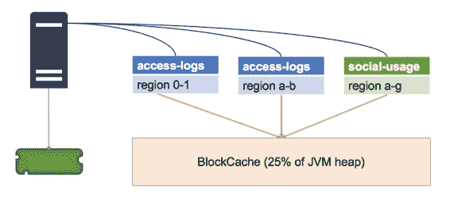
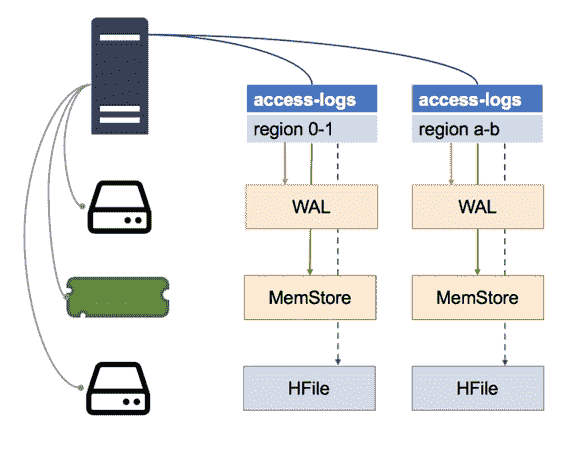

# 第 8 章区域服务器

## 缓存和缓存

虽然 Region Server 利用 HDFS 使其与存储层具有干净的接口，但是增加了复杂性以提供最佳性能。 Region Server 最大限度地减少了与 HDFS 的交互次数，并将热数据保存在缓存中，因此可以在没有慢速磁盘读取的情况下提供服务。

每个 Region Server 中有两种类型的缓存，如图 10 所示：

图 10：Region Server 中的缓存

BlockCache 是​​一个读缓存，它将最近获取的数据保存在内存中; MemStore 是一个写缓存，它将最近写入的数据保存在内存中;最后，还有 HFile，它包含磁盘上的数据。

重要的是要了解这些部分是如何组合在一起的，因为它们会影响性能，并会反馈到表格设计和性能调整中。

## BlockCache

HBase 对最近获取的数据使用内存缓存。每个 Region Server 都有一个 BlockCache，它在服务器托管的所有区域之间共享，如图 11 所示：

图 11：每个服务器一个 BlockCache

默认情况下，分配给 BlockCache 的内存占 Java 虚拟机堆的 25% 。该大小受到服务器中物理内存的限制，这是为什么过多数量的区域会影响性能的一个原因 - 所有区域都将争夺有限的内存空间。

当 Region Server 获取读取请求时，它会检查 BlockCache 以查看数据是否在内存中。如果是这样，它返回并且读取将非常快。如果没有，则服务器检查该区域的 MemStore 以查看最近是否写入了数据。如果没有，则服务器从磁盘上的相关 HFile 读取数据。

BlockCache 使用最近最少使用的逐出策略，因此重复访问的数据项保留在缓存中，并且不经常使用的数据项会自动删除（尽管由于缓存对高性能至关重要，因此 HBase 允许您调整 BlockCache 和使用不同的缓存策略算法）。

## MemStore

MemStore 是一个单独的内存缓存，用于存储最近写入的数据，Region Server 为其托管的每个区域维护一个 MemStore，如图 12 所示：

图 12：每个区域一个 MemStore

MemStore 有两个目的 - 第一个是缓存，所以最近写入的数据可以在访问时从内存中获取，这样可以减少磁盘读取。

MemStore 的第二个更重要的角色是写缓冲区。写入区域不会在收到它们后立即保存到磁盘 - 它们在 MemStore 中缓冲，并且缓冲区中的数据一旦达到配置的大小就会刷新到磁盘。

默认情况下，写入缓冲区在达到 128MB 时刷新，如图 13 所示：

图 13：刷新 MemStore

MemStore 中的数据按行键在内存中排序，因此当它被刷新时，HBase 只对 HDFS 进行一系列快速，顺序读取以保持数据，这已经是正确的顺序。

磁盘上的数据称为 HFile，逻辑上，单个 HFile 包含一个表的一个区域中的一个列族的所有数据。由于 MemStore 和缓冲区然后刷新模式，HFiles 可以由许多物理文件组成，称为 Store Files，每个文件包含来自一个 MemStore 刷新的数据。

对于单个 HFile 具有多个存储文件会影响读取性能，因为从区域服务器获取可能需要它读取磁盘上的许多文件，因此定期 HBase 压缩存储文件，将小文件合并为一个大文件。

您也可以手动强制压缩（我们将在第 10 章“监控和管理 HBase”中介绍）。经过重大压缩后，每个 HFile 都将包含在磁盘上的单个存储文件中，这是读取性能的最佳选择。

## 缓冲和提前写入日志

在写入数据时缓冲数据并定期将其刷新到磁盘可以优化 Region Server 的写入性能，但它也会造成数据丢失的可能性。如果 Region Server 出现故障，则 MemStore 中缓冲的任何写入都将丢失，因为它们不会保留到磁盘。

HBase 具有写入前向日志（WAL）所涵盖的场景，存储在 HDFS 中作为每个区域的单独物理文件。数据更新在 MemStore 中缓冲，但数据更新请求首先在 WAL 中保留，因此 WAL 会记录 MemStore 中缓存的所有更新，如图 14 所示：

图 14：预写日志文件

如果 Region Server 出现故障，当该区域被分配给另一个服务器时，它会在将该区域联机之前检查 WAL。如果在 WAL 中记录了更新，则新的 Region Server 将读取它们并将它们全部保留到 HFile，然后再使该区域可用。

在将更新提交到 WAL 之前，区域服务器不会确认写入请求，并且新区域服务器在区域联机时不接受任何请求（包括将 WAL 刷新到磁盘）。

如果服务器发生故障，当托管区域的数据不可用时，将会有一段时间的停机，但数据不会丢失。

## HFiles 和商店档案

HFile 的结构旨在最大限度地减少 Region Server 为获取数据所必须执行的磁盘读取量。 HFile 仅包含一个区域中一个列族的数据，因此 Region Server 只有在包含所需数据时才会访问该文件。

HFile 中的数据存储在块中，并按行键排序。每个 HFile 都包含一个索引，其中包含从行键到数据块的指针，如图 15 所示：

图 15：HFile 的结构

区域服务器为它们在内存中提供的所有区域保留 HFile 索引，因此当必须从磁盘读取数据时，可以将读取目标指向包含数据的特定块。

随着时间的推移，区域的数据可能会在许多来源中分散，这会对 Region Server 产生额外的影响并降低性能 - 这称为读取放大。

## 读扩增

对于具有密集读写访问权限的表，区域中的数据可能分散在 Region Server 中的所有数据存储中。最近获取的数据将在 BlockCache 中;最近在 MemStore 中写入的数据;和 HFile 中的旧数据。

HFile 也可以由多个商店文件组成，对于单行，我们可以在每个位置包含部分数据，如图 16 所示，其中同一行的不同列分布在四个商店中：

图 16：读扩增

对该行的整个列系列的读取请求将要求 Region Server 从所有这些存储中读取，并合并响应的列。

每个 HFile 具有许多存储文件意味着单个读取请求可以放大到许多磁盘读取。在最坏的情况下，当区域被新分配给区域服务器时，文件可能不是本地的，这意味着多个网络调用，以及远程服务器上的多个磁盘读取。

您可以通过手动运行主要压缩来修复这种情况下的性能下降，我们将在最后一章中介绍。

## 摘要

在本章中，我们查看了 Region Server，了解数据如何实际存储在 HBase 中，以及 Region Server 如何处理读取和写入数据的请求。

我们看到 HBase 在每个 Region Server 中都有一个读缓存，每个区域都有一个写缓冲区来提高性能，还有一个 Write Ahead Log，以确保服务器出现故障时的数据完整性。

最终，数据存储在 HFile 的磁盘上，其中一个 HFile 逻辑上包含一个表的一个区域中的一个列族的所有数据。但缓冲模式意味着逻辑 HFile 可以在磁盘上拆分为多个存储文件，这可能会损害读取性能。

在下一章中，我们将介绍通过 HMaster Web UI 和 HBase Shell 监控和管理 HBase，包括查找和修复这些性能问题。