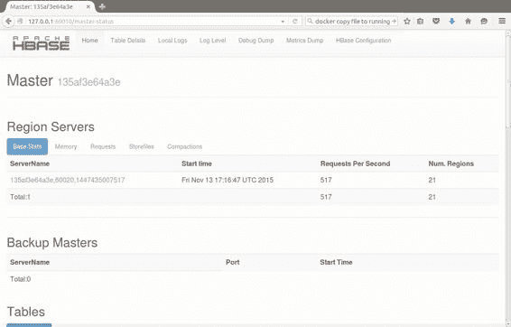
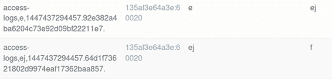

# 第 9 章监测和管理 HBase

## HBase Web UI

所有 HBase 服务都提供了一个简单的 Web UI，它为您提供有关服务运行方式的基本信息，并使您可以访问日志。这些对于故障排除和诊断非常有用，核心服务 - 主服务器和区域服务器 - 具有更丰富的 Web UI，可以告诉您很多关于数据库运行状况的信息。

Web UI 是使用 Jetty Web Server（内存占用少，响应时间快）嵌入的，因此它们在您运行相关服务时启动。他们都是不安全的网站;它们在没有 HTTP 身份验证的情况下运行每个 UI 都在非标准 HTTP 端口上运行，因此如果要限制 UI 的可用性，则需要阻止对端口的外部访问。

Docker 容器 hbase-succinctly 运行所有 HBase 服务器并公开所有 UI 端口，因此您可以运行实例并浏览到每个 UI。

## 外部 API UI

Thrift 和 Stargate UI 为每个服务器提供相同的基本信息。图 17 显示了 Thrift UI 的主页，它在端口 9095 上运行：


图 17：Thrift Server UI

类似的界面如图 18 所示，Stargate UI 在端口 8085 上运行：


图 18：Stargate UI

两个 UI 都显示正在运行的 HBase 的确切版本，包括 git 提交 ID（在修订字段中）以及服务器的正常运行时间。如果服务器未运行，您将无法从 Web UI 获得响应。

Thrift UI 还显示了一些关键设置细节（它接受的传输和协议类型），并且两个 UI 都具有相同的链接集：

· 本地日志 - 查看服务器上的日志文件

· 日志级别 - 获取或设置服务器的日志级别

· Metrics Dump - 提供服务器统计信息的详细转储

· HBase 配置 - 显示服务器的所有配置设置

最后两个链接值得单独查看。 Metrics Dump（URL 是来自基本路径的 / jmx ）提供了一个 JSON 输出，其中包含从服务器中运行的 Java Management Extensions 捕获的大量信息。

您可以使用 JMX 客户端导航输出，或添加自定义监视以查询服务器并解析 JSON 作为自动诊断测试的一部分。代码清单 61 显示了 Metrics Dump 输出的 JVM 堆使用部分：

代码清单 61：JMX Metrics Dump

```
"HeapMemoryUsage": {
    "committed": 62652416,
    "init": 64689792,
    "max": 1018560512,
    "used": 16339616
}

```

HBase 配置链接（来自基本 URL 的 / conf ）以 XML 格式返回活动的 HBase 配置。每个属性都包含当前值和值的来源（可能是服务器的 hbase-site.xml ，或 HBase 默认值），这对于跟踪错误配置的环境非常有用。

代码清单 62 显示了 HBase 配置中的 Zookeeper 地址：

代码清单 62：XML 配置设置

```
<property>
 <name>hbase.zookeeper.quorum</name>
 <value>localhost</value>
 <source>hbase-default.xml</source>
</property>

```

## 区域服务器 UI

在区域服务器上，Web UI 具有与外部 API UI 相同的日志，指标和配置链接，但它包含有关服务器性能及其提供的数据的更多详细信息。

图 19 显示了 Region Server UI 的主页，它在端口 60030 上运行：


图 19：Region Server Web UI

“服务器度量标准”部分告诉您这个区域服务器的工作难度 - 它托管的区域数量，以及当前服务的每秒请求数。这些是来自任何 API 的请求，因此如果您使用的是 Java，Thrift 和 Stargate 客户端，则总使用量将显示在此处。

您可以深入查看指标以检查服务器的内存使用情况，并查看区域正在使用的 WAL 和存储文件的细分。 Requests 选项卡（如图 20 所示）显示所提供的累积请求：


图 20：Region Server UI 中的服务器指标

这些统计信息是所有区域的组合读写计数，因为服务器一直在运行。

主页还显示任何长时间运行的任务及其状态。在图 21 中，绿色条突出显示区域的块缓存已完成刷新（在本例中为元数据表， hbase：meta ）：


图 21：区域服务器 UI 中的任务状态

Region Server UI 值得进一步探索。您还可以获得有关缓存工作情况以及服务器托管的所有区域（使用开始和结束行键）以及每个区域的请求数的详细信息。

这些细节有助于了解您的区域如何在服务器之间进行平衡，并有助于您检测任何热点，如图 22 所示，其中访问日志表的区域 e 有 75K 读取请求，相邻区域为 0：


图 22：UI 中的区域热点

## 主服务器 UI

虽然区域服务器 UI 很有用，但主服务器 UI 在更高级别运行，显示所有区域服务器的性能和指标。这是第一个检查 HBase 系统健康状况的地方。

默认情况下，Web UI 在主服务器上的端口 60010 上运行。如果您正在运行多个主服务器，则只有活动主服务器显示任何信息。主屏幕（如图 23 所示）打开，其中包含所有区域服务器的摘要，说明每个区域服务的区域数，以及它们当前每秒处理的请求数：



图 23：主 Web UI

在“区域服务器”部分中，主 UI 还会显示“区域服务器”中的组合详细信息，以了解其内存使用情况，各个区域请求和“存储文件”。 Compactions 选项卡会告诉您是否发生了任何重大压缩，以及它们处于什么状态。

在顶级导航中，您可以访问主服务器的本地日志文件并更改日志级别，以及查看度量标准转储和 HBase 配置。 Debug Dump 为您提供了关于服务器正在做什么的非常低级的详细信息（除非它行为不当，否则您很少需要），但是 Table Details 链接为您提供了如图 24 所示的有用信息：


图 24：主 UI 中的表格详细信息

此页面显示数据库中定义的每个表，以及完整配置（您可以看到第 2 章中的 with-custom-config 表有三个为列系列指定的版本，而默认值为 1）其他表）。

## 使用 Shell 管理 HBase

我们在第 4 章，第 5 章和第 6 章中看到的所有客户端 API 都具有 DDL 功能，但我更喜欢保持客户端代码免于管理工作，并使用 HBase Shell 脚本进行 DDL 和管理。还有一些只能从 Shell 获得的管理功能。

通常，您需要在 HBase 上执行的管理功能适用于未按预期方式使用表的情况，并且性能正在下降。表格在一个区域中具有比其他区域更多活动数据的热点可以通过手动拆分表来纠正。

split 命令可以在不同级别使用，可以分割命名区域或命名表。拆分现有表时，通常是因为您更了解数据的分布方式，HBase 允许您为新区域提供拆分键，如代码清单 63 所示：

代码清单 63：拆分现有表

```
hbase(main):006:0> split 'access-logs', 'ej'
0 row(s) in 0.4650 seconds

```

图 25 显示了主 UI 中的表格详细信息，在分割之后，原始 e 区域现在是两个独立的区域：



图 25：主 UI 中的区域分割

手动拆分区域时，新区域将与原始区域位于同一服务器上。这保留了数据位置，因为原始数据全部在一台服务器上，但如果您想要删除热点并在更多服务器之间共享数据，则无效。

任何时候您的区域不平衡（例如，如果您手动拆分它们或添加新表），您可以使用平衡器命令强制重新平衡，该命令在没有参数的情况下运行，如图所示代码 64：

代码清单 64：启动负载均衡器

```
hbase(main):007:0> balancer
true                                                                                                                                       
0 row(s) in 0.0680 seconds

```

如果平衡器命令能够启动重新平衡过程，则返回 true 。平衡器实际上是异步运行的，并将在命令返回后继续。如果 Master 已经从另一个进程移动了区域，则无法启动重新平衡，命令将返回 false 。

可能损害性能的最终情况是，由于区域被移动或服务器被添加到群集，您的区域被拆分为多个商店文件，和/或您的数据位置较差。要解决这个问题，您需要一个主要的压缩，它将两个或多个存储文件组合成一个区域和列系列的 HFile，并确保每个 HFile 都是托管它的 Region Server 的本地。

HBase 将按计划大约每 24 小时运行一次主要压缩，如果在高峰访问时间内发生，将影响性能。如果您知道数据是碎片化的，那么最好在服务器负载较低时运行手动压缩。

使用 major_compact 命令启动压缩，您可以压缩整个表，列族，区域或区域内的一个列族。代码清单 65 显示了 access-logs 表的压缩开始：

代码清单 65：开始表的主要压缩

```
hbase(main):002:0> major_compact 'access-logs'
0 row(s) in 0.2990 seconds

```

压缩可能需要很长时间，尤其是对于具有许多区域的大型表。 Region Server UI 中的 Region 视图显示了压缩进度，但这一切都发生在后台，压缩区域在压缩运行时仍然可以读写。

## 摘要

通过在所有服务器进程中嵌入 Web UI，HBase 为您提供了有关数据库执行方式的大量信息。还使用 JMX 收集度量标准，这使得将它们插入像 Ganglia 这样的第三方监视工具变得很容易。

Thrift 和 Stargate 用户界面为您提供了一个基本概述，以显示这些服务器的性能，但主要和区域用户界面可让您深入了解数据的结构以及如何使用它们。您可以轻松地查看一个区域服务器比管理 UI 更加努力的热点。

使用 HBase Shell，您可以纠正更常见的性能问题，我们了解了如何手动拆分表，强制主服务器跨服务器重新平衡区域，并运行主要压缩以优化存储级别的数据。

## 后续步骤

HBase 的内容远远超过我在这本短篇小说中所涵盖的内容，如果您认为 HBase 非常适合您的下一个数据存储，那么还有很多可以探索的内容。如果您想使用首选客户端尝试 HBase，那么本书附带的 Docker 镜像是一个很好的起点。

如果您想在生产环境中尝试 HBase 而无需调试一套服务器，则可以在 AWS 上使用 Elastic MapReduce 和 Azure 上的 HDInsight 在云中运行托管 HBase 集群。

两种云都提供了一种简单的入门方式

高性能集群，使用 Azure，您可以注册一个新帐户，并在 HDInsight 上免费试用 HBase 一周。如果你想看看 HBase 如何在 Azure 上与 Hadoop 生态系统的其他部分一起工作，我在我的 Pluralsight 课程中构建了一个完整的解决方案， [HDInsight Deep Dive：Storm，HBase 和 Hive](https://www.pluralsight.com/courses/hdinsight-deep-dive-storm-hbase-hive) ，现已推出。