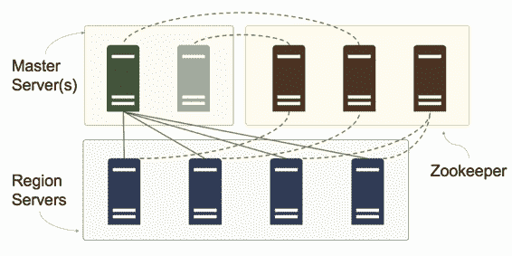

# 第 7 章 HBase 的架构

## 零部件

在 HBase 的分布式部署中，该体系结构有四个组件，它们共同构成 HBase 服务器：

· 区域服务器 - 计算托管区域并提供数据访问的节点

· 主服务器 - 协调区域服务器并运行后台作业

· Zookeeper - 包含共享配置并通知主服务器有关服务器故障

· Hadoop 分布式文件系统（HDFS） - 物理托管在主服务器和区域服务器之间的存储层

图 5 显示了 HBase 分布式安装中组件之间的关系，其中组件在多个服务器上运行：

图 5：分布式 HBase 集群

在多个服务器上托管每个组件可在生产环境中提供弹性和性能。作为首选最小值，群集应具有两个主服务器，三个 Zookeeper 节点和四个区域服务器。

 注意：HBase 集群中的每个节点都应具有专用角色。不要尝试在 Region Servers 上运行 Zookeeper - 整个集群的性能和可靠性会降低。每个节点应位于单独的物理或虚拟机上，所有这些都在同一物理或虚拟网络中。

在生产中运行 HBase 并不一定要求您调试九台服务器来运行内部部署。您可以在云中启动托管 HBase 群集，并且只在需要时支付计算能力。