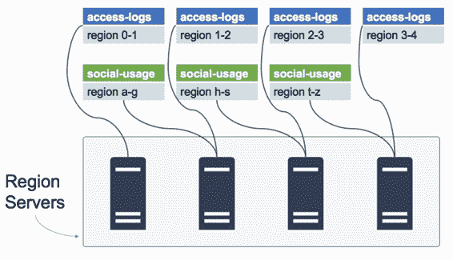

## 区域服务器

区域服务器托管区域并使其可供客户端访问。从 Region Server，客户端可以执行读取和写入请求，但不能执行任何元数据更改或管理功能。

单个 Region Server 可以托管来自相同或不同表的多个区域，如图 7 所示，Region Server 是 HBase 中水平缩放的单位。要获得更高的性能，您可以添加更多区域服务器，并确保跨服务器的区域平衡分割。

图 7：跨区域服务器分布的区域

表的每个区域由单个 Region Server 托管，与其他 Region Servers 的客户端连接将无法访问该区域的数据。

要查找正确的 Region Server，客户端将查询 HBase 元数据表（称为 hbase：meta ），该表包含表，区域和已分配的 Region Servers 列表。分配区域时，主服务器使元数据表保持最新。

正如我们所见，查询 HBase 元数据以查找 Region Server 通常是在客户端代码中抽象的，因此消费者使用更高级别的概念，如表和行，客户端库负责查找正确的 Region Server 并制作连接。

区域服务器通常是 HDFS 数据节点，在健康的 HBase 环境中，每个区域服务器都将托管其服务的所有区域的本地磁盘上的数据。这是 100% 的数据位置，它意味着对于每个客户端请求，区域服务器必须做的最多是从本地磁盘读取。

当区域在服务器之间移动时，数据局部性会降低，并且区域服务器不会在本地保存其区域的数据，但需要通过网络从另一个数据节点请求它。糟糕的数据位置意味着整体性能不佳，但有一些功能可以解决这个问题，我们将在第 10 章“监控和管理 HBase”中介绍 HBase 管理。