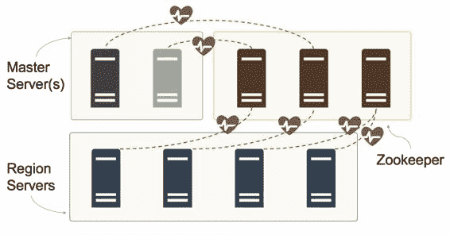

## Zookeeper

Zookeeper 用于集中配置，以及群集中的服务器脱机或联机时的通知。 HBase 主要使用 Zookeeper 中的短暂 znode ，存储用于组件之间协调的状态数据;它不用作 HBase 数据的存储。

所有主服务器和区域服务器都使用 Zookeeper。每个服务器都有一个节点，用于表示其心跳，如图 8 所示。如果服务器失去与 Zookeeper 的连接，则心跳停止，经过一段时间后，服务器将被假定为不可用。

图 8：与 Zookeeper 的心跳连接

活动主服务器在所有区域服务器心跳节点上都有一个监视，因此它可以对脱机或联机的服务器做出反应，被动主服务器在活动主服务器的心跳节点上有监视，因此它可以对主服务器作出反应离线。

虽然 Zookeeper 不用作永久数据存储，但其可用性对于 HBase 集群的健康性能至关重要。因此，Zookeeper 集合应该运行多个服务器，一个奇数用于在出现故障时保持多数（三个节点集合可以在一个服务器丢失的情况下存活;一个五节点集合可以在两个服务器丢失的情况下存活）。