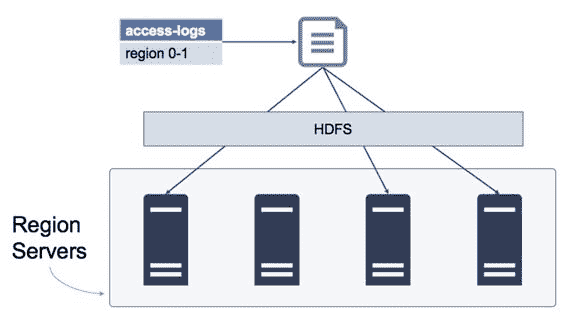

## HDFS

生产 HBase 集群是 Hadoop 集群，其中 HDFS 名称节点在主服务器上运行，数据节点在区域服务器上运行。

包含区域和列族数据的文件存储在 HDFS 中。您无需彻底了解 HDFS 即可了解它与 HBase 的匹配程度。可以说，HDFS 中的数据在数据节点中被复制三次，如图 9 所示。如果一个节点出现中断，则数据仍可从其他节点获得。

图 9：HDFS 中存储的 HBase 数据

HBase 依赖于 HDFS 来保证数据的完整性，因此 Region Server 的存储部分在概念上非常简单。当 Region Server 提交对磁盘的更改时，它假定来自 HDFS 的可靠性，并且当它从磁盘获取数据时，它假定它可用。