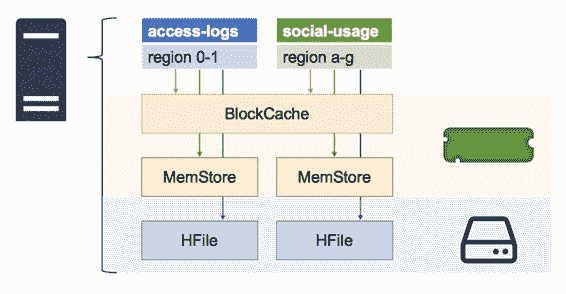

# 第 8 章区域服务器

## 缓存和缓存

虽然 Region Server 利用 HDFS 使其与存储层具有干净的接口，但是增加了复杂性以提供最佳性能。 Region Server 最大限度地减少了与 HDFS 的交互次数，并将热数据保存在缓存中，因此可以在没有慢速磁盘读取的情况下提供服务。

每个 Region Server 中有两种类型的缓存，如图 10 所示：

图 10：Region Server 中的缓存

BlockCache 是​​一个读缓存，它将最近获取的数据保存在内存中; MemStore 是一个写缓存，它将最近写入的数据保存在内存中;最后，还有 HFile，它包含磁盘上的数据。

重要的是要了解这些部分是如何组合在一起的，因为它们会影响性能，并会反馈到表格设计和性能调整中。