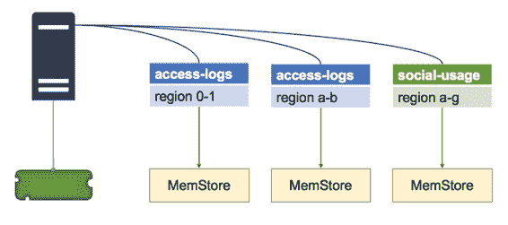
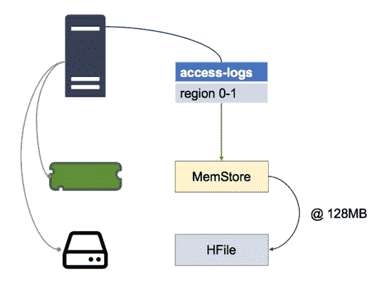

## MemStore

MemStore 是一个单独的内存缓存，用于存储最近写入的数据，Region Server 为其托管的每个区域维护一个 MemStore，如图 12 所示：

图 12：每个区域一个 MemStore

MemStore 有两个目的 - 第一个是缓存，所以最近写入的数据可以在访问时从内存中获取，这样可以减少磁盘读取。

MemStore 的第二个更重要的角色是写缓冲区。写入区域不会在收到它们后立即保存到磁盘 - 它们在 MemStore 中缓冲，并且缓冲区中的数据一旦达到配置的大小就会刷新到磁盘。

默认情况下，写入缓冲区在达到 128MB 时刷新，如图 13 所示：

图 13：刷新 MemStore

MemStore 中的数据按行键在内存中排序，因此当它被刷新时，HBase 只对 HDFS 进行一系列快速，顺序读取以保持数据，这已经是正确的顺序。

磁盘上的数据称为 HFile，逻辑上，单个 HFile 包含一个表的一个区域中的一个列族的所有数据。由于 MemStore 和缓冲区然后刷新模式，HFiles 可以由许多物理文件组成，称为 Store Files，每个文件包含来自一个 MemStore 刷新的数据。

对于单个 HFile 具有多个存储文件会影响读取性能，因为从区域服务器获取可能需要它读取磁盘上的许多文件，因此定期 HBase 压缩存储文件，将小文件合并为一个大文件。

您也可以手动强制压缩（我们将在第 10 章“监控和管理 HBase”中介绍）。经过重大压缩后，每个 HFile 都将包含在磁盘上的单个存储文件中，这是读取性能的最佳选择。