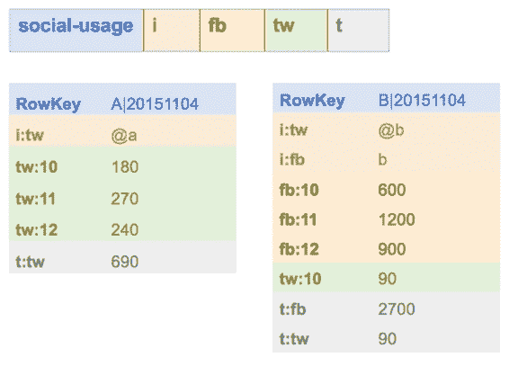

## HBase 表设计

HBase 非常灵活，但访问数据的主要方法是使用行键，因此表的设计对于解决方案的性能至关重要。在社交用法表中，我们为每个用户存储一行，并且对于每个报告周期，我们将向列族添加更多单元格。

这称为**宽表**设计 - 我们有一个（相对）少量的行，但行可能有很多列。如果我们记录每小时的使用情况，那么对于活跃用户，我们可以每周添加 98 个单元格（一周中每小时一个单元格）。几年之后，我们将为该用户的行提供数万个单元 - 这对于 HBase 来说不是一个问题，但是我们可能难以高效使用。

如果我们想要计算特定月份的用户活动，我们需要通过按列限定符名称过滤结果来读取行并包含该月的单元格。基于列的过滤对于 HBase 比基于行的过滤要昂贵得多，因此替代设计将是使用**高表**设计。

高大的表具有更多行，每行具有更少的列数。我们可以为每个用户的每个句点设置一行，而不是为每个用户分配一行，这将为我们提供图 3 中的数据：



图 3：高台设计

现在，该行包含用户名和句点，即数据的日期。列名要短得多，因为我们只捕获列名中的小时，并且行中的所有数据都是相同的日期。对于活跃用户，我们每行只有几十列，数百行可以记录一年的数据。

此设计使用复合行键，格式为`{userID} | {period}`，因此如果我们想要将用户的使用量相加一段时间，我们可以通过行扫描来实现，这比柱式过滤器便宜得多，我们稍后会看到这两种情况。

 注意：您需要设计 HBase 表以支持您期望的数据访问模式，但通常高表优于宽表。

代码清单 1 显示了用于创建社交用法表的数据定义语言（DDL）语句。它包含您需要的最小金额 - 表名，后跟列族名：

代码清单 1：创建 DDL 语句

```
create 'social-usage', 'i', 'fb', 'tw', 't'

```

HBase 中的模式定义是故意模糊的。未指定行键和列限定符的格式，并且没有数据类型。

使用该表的约定在模式中不明确，实际上我们可以对宽表使用完全相同的模式（仅使用行键的用户 ID）或高表（使用用户 ID 和句点）行键）。