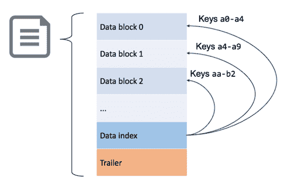

## HFiles 和商店档案

HFile 的结构旨在最大限度地减少 Region Server 为获取数据所必须执行的磁盘读取量。 HFile 仅包含一个区域中一个列族的数据，因此 Region Server 只有在包含所需数据时才会访问该文件。

HFile 中的数据存储在块中，并按行键排序。每个 HFile 都包含一个索引，其中包含从行键到数据块的指针，如图 15 所示：

图 15：HFile 的结构

区域服务器为它们在内存中提供的所有区域保留 HFile 索引，因此当必须从磁盘读取数据时，可以将读取目标指向包含数据的特定块。

随着时间的推移，区域的数据可能会在许多来源中分散，这会对 Region Server 产生额外的影响并降低性能 - 这称为读取放大。