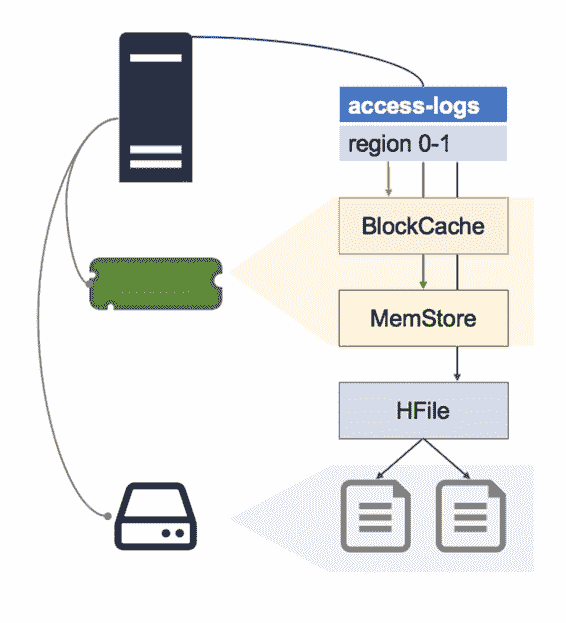

## 读扩增

对于具有密集读写访问权限的表，区域中的数据可能分散在 Region Server 中的所有数据存储中。最近获取的数据将在 BlockCache 中;最近在 MemStore 中写入的数据;和 HFile 中的旧数据。

HFile 也可以由多个商店文件组成，对于单行，我们可以在每个位置包含部分数据，如图 16 所示，其中同一行的不同列分布在四个商店中：

图 16：读扩增

对该行的整个列系列的读取请求将要求 Region Server 从所有这些存储中读取，并合并响应的列。

每个 HFile 具有许多存储文件意味着单个读取请求可以放大到许多磁盘读取。在最坏的情况下，当区域被新分配给区域服务器时，文件可能不是本地的，这意味着多个网络调用，以及远程服务器上的多个磁盘读取。

您可以通过手动运行主要压缩来修复这种情况下的性能下降，我们将在最后一章中介绍。