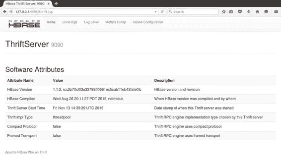
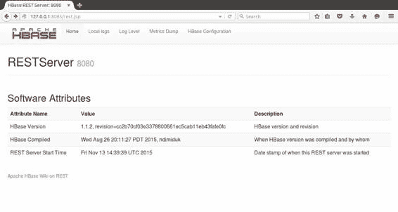

## 外部 API UI

Thrift 和 Stargate UI 为每个服务器提供相同的基本信息。图 17 显示了 Thrift UI 的主页，它在端口 9095 上运行：



图 17：Thrift Server UI

类似的界面如图 18 所示，Stargate UI 在端口 8085 上运行：



图 18：Stargate UI

两个 UI 都显示正在运行的 HBase 的确切版本，包括 git 提交 ID（在修订字段中）以及服务器的正常运行时间。如果服务器未运行，您将无法从 Web UI 获得响应。

Thrift UI 还显示了一些关键设置细节（它接受的传输和协议类型），并且两个 UI 都具有相同的链接集：

· 本地日志 - 查看服务器上的日志文件

· 日志级别 - 获取或设置服务器的日志级别

· Metrics Dump - 提供服务器统计信息的详细转储

· HBase 配置 - 显示服务器的所有配置设置

最后两个链接值得单独查看。 Metrics Dump（URL 是来自基本路径的 / jmx ）提供了一个 JSON 输出，其中包含从服务器中运行的 Java Management Extensions 捕获的大量信息。

您可以使用 JMX 客户端导航输出，或添加自定义监视以查询服务器并解析 JSON 作为自动诊断测试的一部分。代码清单 61 显示了 Metrics Dump 输出的 JVM 堆使用部分：

代码清单 61：JMX Metrics Dump

```
"HeapMemoryUsage": {
    "committed": 62652416,
    "init": 64689792,
    "max": 1018560512,
    "used": 16339616
}

```

HBase 配置链接（来自基本 URL 的 / conf ）以 XML 格式返回活动的 HBase 配置。每个属性都包含当前值和值的来源（可能是服务器的 hbase-site.xml ，或 HBase 默认值），这对于跟踪错误配置的环境非常有用。

代码清单 62 显示了 HBase 配置中的 Zookeeper 地址：

代码清单 62：XML 配置设置

```
<property>
 <name>hbase.zookeeper.quorum</name>
 <value>localhost</value>
 <source>hbase-default.xml</source>
</property>

```