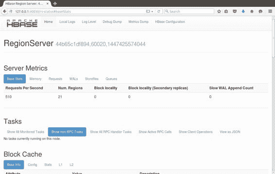
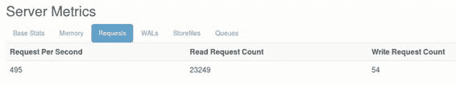
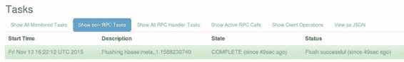
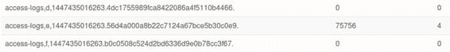

## 区域服务器 UI

在区域服务器上，Web UI 具有与外部 API UI 相同的日志，指标和配置链接，但它包含有关服务器性能及其提供的数据的更多详细信息。

图 19 显示了 Region Server UI 的主页，它在端口 60030 上运行：

图 19：Region Server Web UI

“服务器度量标准”部分告诉您这个区域服务器的工作难度 - 它托管的区域数量，以及当前服务的每秒请求数。这些是来自任何 API 的请求，因此如果您使用的是 Java，Thrift 和 Stargate 客户端，则总使用量将显示在此处。

您可以深入查看指标以检查服务器的内存使用情况，并查看区域正在使用的 WAL 和存储文件的细分。 Requests 选项卡（如图 20 所示）显示所提供的累积请求：

图 20：Region Server UI 中的服务器指标

这些统计信息是所有区域的组合读写计数，因为服务器一直在运行。

主页还显示任何长时间运行的任务及其状态。在图 21 中，绿色条突出显示区域的块缓存已完成刷新（在本例中为元数据表， hbase：meta ）：

图 21：区域服务器 UI 中的任务状态

Region Server UI 值得进一步探索。您还可以获得有关缓存工作情况以及服务器托管的所有区域（使用开始和结束行键）以及每个区域的请求数的详细信息。

这些细节有助于了解您的区域如何在服务器之间进行平衡，并有助于您检测任何热点，如图 22 所示，其中访问日志表的区域 e 有 75K 读取请求，相邻区域为 0：

图 22：UI 中的区域热点