# 第 10 章使用 Microsoft BI 套件可视化结果

处理 Hadoop 上的数据是故事的重要部分。但是，对于用户从中提取价值，他们需要能够操纵和可视化它。 Microsoft BI 套件 - 通过数据建模工具 PowerPivot 和数据可视化工具 PowerView - 通过熟悉的 Excel 界面实现此功能。

## Hive ODBC 驱动程序和 PowerPivot

Microsoft Big Data 用户可用的部分工具集是 Hive ODBC 驱动程序。这允许与 Hive 数据库的 ODBC 连接直接或作为 PowerPivot 模型中的数据源将结果提取到 Excel 中。在此示例中，我们将使用先前步骤的结果输出作为 PowerPivot 模型的数据源。

### 安装 Hive ODBC 驱动程序

需要在客户端计算机上安装 Hive 驱动程序。可以从 Microsoft 下载中心获得最新版本的驱动程序，可以在 HDInsight 文档中找到最新驱动程序的位置。 [&lt;sup&gt;[26]&lt;/sup&gt;](../Text/hdi-13.html#_ftn26)

只需下载并安装客户端计算机的相应驱动程序即可。

### 为 Hive 设置 DSN

连接到 Hive 的先决条件是设置 Excel 可以引用的 64 位系统数据源名称（DSN）。搜索 ODBC 会带来两个应用程序：

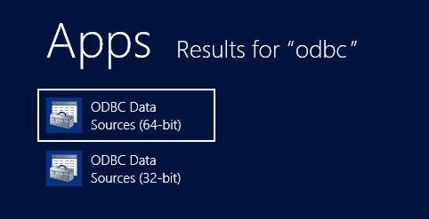

图 8：ODBC 应用程序

从此处启动 ODBC 数据源管理器。在“系统 DSN”下，选择“添加”。选择“创建新数据源”时，Hive 驱动程序将列为可用选项：

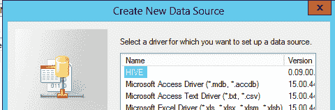

图 9：使用 Hive ODBC 驱动程序创建新的系统 DSN

选择它并选择 OK 将带您进入 Hive 数据源配置，需要更新以匹配特定的系统设置：

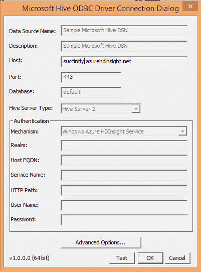

图 10：配置 Hive DSN

完成此步骤后，我们可以将数据导入 Excel。

### 将数据导入 Excel

从 Excel 中开始，在 PowerPivot 选项卡上，选择管理数据模型：

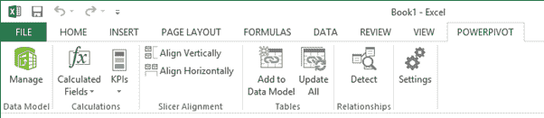

图 11：Excel PowerPivot 功能区选项卡

这将为您提供获取外部数据的选项（在本例中为“来自其他来源”）：

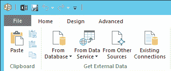

图 12：Excel PowerPivot 管理数据模型功能区

这将打开表导入向导。在“关系数据库”部分下，选择“其他（OLEDB / ODBC）”，然后单击“下一步”：

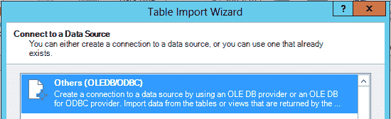

图 13：Excel PowerPivot 表导入向导 - 数据源类型选择

然后会提示您输入连接字符串。选择构建选项，然后在提供程序选项卡上，选择“Microsoft OLE DB Provider for ODBC Drivers”：

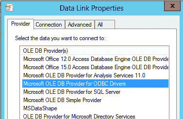

图 14：Excel PowerPivot 表导入向导 - 数据链接类型选择

单击“下一步”将进入“连接”选项卡;然后，您可以选择之前创建的 DSN。从那里，单击下一步，直到显示要导入的表列表：

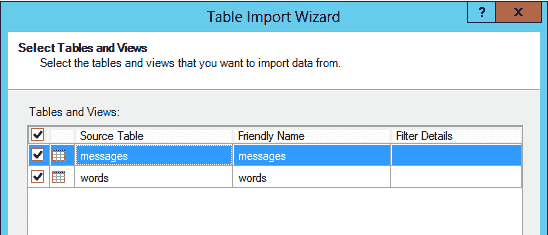

图 15：Excel PowerPivot 表导入向导 - 选择 Hive 表

选择所有相关表格并选择完成。来自 Hive 的数据现在可在 PowerPivot 中用于建模和分析，作为正常数据模型的一部分：

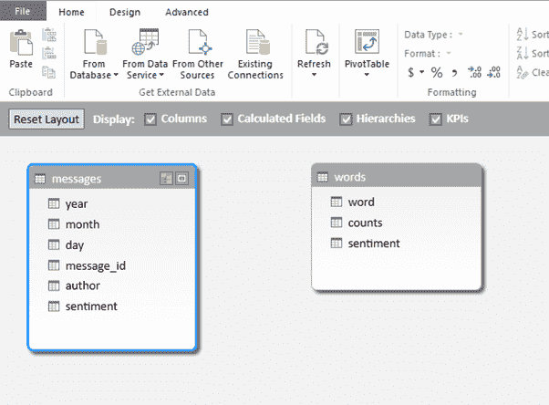

图 16：Excel PowerPivot 数据模型图视图

## 在 PowerPivot 中添加上下文

PowerPivot 的一部分功能是它能够利用来自其他来源的其他信息（也称为“混搭”）来丰富您的数据，并添加额外的计算和分析措施的方法。其中一些将在下面显示。

### 从 Windows Azure DataMarket 导入日期表

数据为匿名化的其他人口统计或用户数据提供的空间很小。但是，通过添加具有适当层次结构的日期表，可以在时间周围添加一些洞察力。

Windows Azure DataMarket 上提供了以 BI 为中心的日期表。要使用此功能，请在使用“获取外部数据”选项时选择“从数据服务”和“从 Windows Azure 市场”：

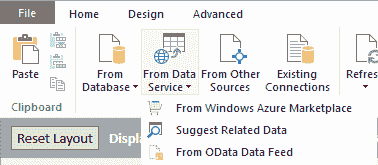

图 17：Excel PowerPivot 从数据服务导入数据

这将我们带到 Windows Azure Marketplace 浏览器。搜索“DateStream”设置将我们带到 Boyan Penev 的日期集，该日期集是专为 PowerPivot 使用而设计的：

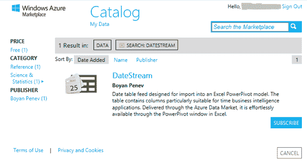

图 18：Excel Windows Azure Marketplace 浏览器

选择订阅（需要 Windows Live 帐户，但数据集本身是免费的）。按照各个步骤操作，直至到达“选择查询”屏幕：

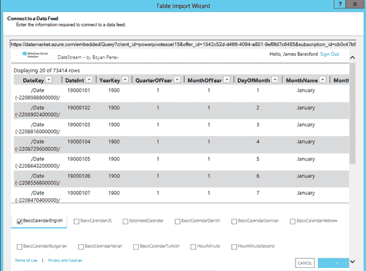

图 19：Excel Windows Azure Marketplace 数据馈送选项

在这里，取消选中除“BasicCalendarEnglish”之外的所有选项，以便我们将检索到的内容限制为与我们的分析相关的内容。

完成整个过程中的其余步骤，将所有内容保留为默认值。现在，“BasicCalendarEnglish”表将添加到数据模型中。

### 创建日期层次结构

为了提高用户友好性，我们将在 Date 表上创建一个可浏览的日历层次结构。在数据模型管理器中，右键单击“BasicCalendarEnglish”表中的 YearKey 列，然后选择“Create Hierarchy”：

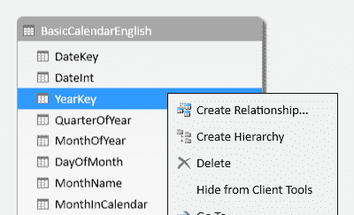

图 20：Excel PowerPivot 数据模型 - 创建层次结构

将其命名为 Calendar。然后通过右键单击并选择“添加到层次结构”并选择“日历”，将 MonthName 和 DayOfMonth 列添加到层次结构中：

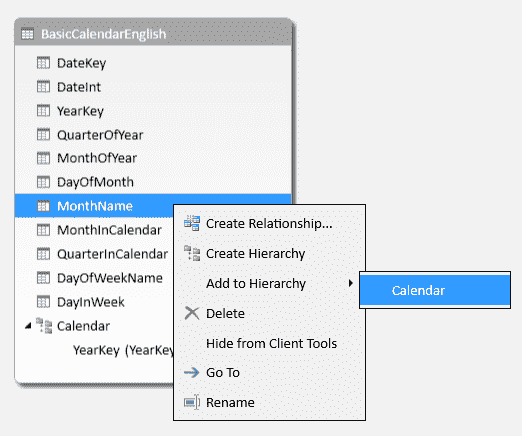

图 21：Excel PowerPivot 数据模型 - 向层次结构添加级别

已创建日历层次结构。 PowerPivot 足够智能，无需任何用户干预即可确定级别和树。

### 链接到情绪数据

最后一步是将日期表连接到模型中的日期敏感数据。为此，我们需要在数据上创建一个与日期表上的键匹配的键。在这种情况下，我们将使用“DateInt”列，它是 YYYYMMDD 格式的整数。

根据我们的数据，我们有三列：年，月和日。首先，我们需要创建一个计算列，它将以匹配的格式保存数据。这可以通过一个相当简单的数据分析表达式（DAX）计算的列来完成，该列根据需要在月和日填充额外的零，如下所示：

```
DateKey = ([year]*10000)+([month]*100)+[day]

```

返回图表视图，将 DateInt 列从“BasicCalendarEnglish”表拖到“messages”表创建两个表之间的关系，并允许使用 Calendar 层次结构查看消息数据。

### 添加分析措施

为了检查数据的各个方面，例如帖子的数量，我们需要为可以通过数据模型快速评估的数据添加度量。 [&lt;sup&gt;[27]&lt;/sup&gt;](../Text/hdi-13.html#_ftn27)


图 22：向数据模型添加度量

这是在数据视图中完成的。单击数据下方区域（箭头 1）中的单元格，可以在公式栏中输入公式（箭头 2）。

从这里我们可以使用 DAX 表达式语言输入一个简单的计数测量：

```
Message Count:=COUNTA([message_id])

```

这使用 COUNTA 函数来计算所有非空单元格 - 我们知道在这种情况下所有 message_ids 都是非空的，因此可用于计算所有消息。 [&lt;sup&gt;[28]&lt;/sup&gt;](../Text/hdi-13.html#_ftn28)

这些度量是上下文感知的，因此，当使用切片器时，这些将根据所使用的切片器给出正确的值（例如，如果您正在查看用户的消息计数，它将为该用户提供适当的计数）。

可以引入更复杂的措施，例如计算每条消息的平均情绪：

```
Sentiment per Message:=sum([sentiment])/COUNTA([message_id])

```

这使用一个简单的求和函数而不是情绪，然后除以消息计数以获得每条消息的平均情绪。这是上下文感知的，因此它可用于确定每个用户的平均情绪或情绪趋势。

## 在 PowerView 中可视化

在 Excel 中，我们可以使用 PowerView 分析工具对我们创建的数据模型可视化数据。

在 Excel 2013 中，在功能区的“插入”选项卡下，我们可以启动“PowerView”：

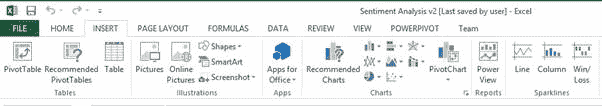

图 23：在 Excel 中启动 PowerView

这使我们能够根据我们创建的数据模型构建报告，从模型中的字段中选择：

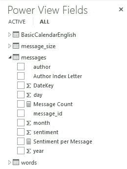

图 24：PowerView 字段浏览

通过简单的拖放操作，可以轻松创建具有丰富交互性的数据可视化。一些例子如下所示。

第一个例子是通过作者姓名的第一个字母查看作者姓名（不包括“未知数”）的分布。这突出了大部分作者姓名以字母“o”开头 - 一个值得进一步调查的异常。

它的条形图显示了作者姓名的第一个字母的帖子数量，还有一个列出最多产作者的表格：

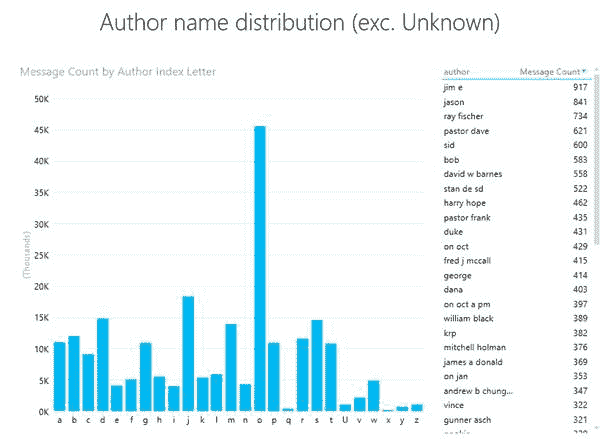

图 25：PowerView 示例报告“作者姓名分发”

下一个报告查看与帖子计数相关的情感，显示为散点图。由于数据点的数量，出现警告，指示仅显示代表性样本。

该报告似乎表明帖子长度与帖子整体情绪之间没有很强的关系：

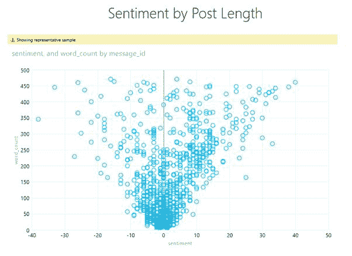

图 26：PowerView 示例报告“按帖子长度的情感”

最后一个例子显示了“作者随时间变化的情绪”。这可以由作者使用左侧的条形图进行过滤，显示作者的帖子计数：

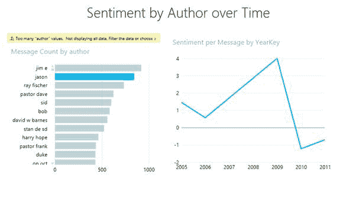

图 27：PowerView 示例报告“作者随时间变化的情绪”

## PowerQuery 和 HDInsight

访问 HDInsight 数据的第二个选项是使用最近发布的 Excel 加载项 PowerQuery。 [&lt;sup&gt;[29]&lt;/sup&gt;](../Text/hdi-13.html#_ftn29) 这样可以直接从 HDInsight 群集中提取文本文件，或者严格来说，与群集关联的 Azure Blob 存储。 [&lt;sup&gt;[30]&lt;/sup&gt;](../Text/hdi-13.html#_ftn30) 符合 HDInsight 的体系结构，其中计算与存储分离，访问输出从 HDInsight 作业开始，计算群集无需启动并运行。

目前，这种数据访问功能并未扩展到 PowerPivot，因此在 Excel 中引入大量数据进行分析的能力有限。