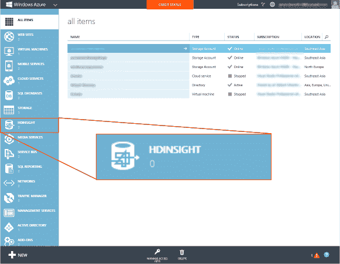
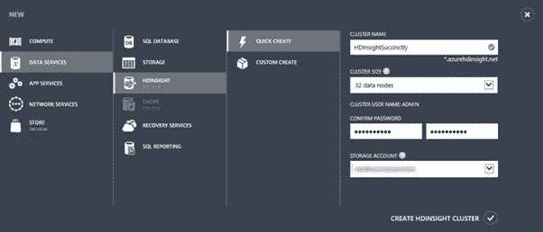

# 第 4 章配置 HDInsight 集群

配置 HDInsight 群集旨在展示云的真正容量，以便简单快速地交付基础架构。配置九节点集群（一个节点和八个工作节点）的过程可能只需 15 分钟即可完成。

HDInsight 是通过 Windows Azure 平台提供的一系列服务的一部分。 HDInsight 于 2013 年 10 月作为公开服务正式推出。

一旦授予对该计划的访问权限，HDInsight 将出现在可用服务的选择中：

图 1：Azure 门户的 HDInsight

要创建群集，请选择 HDInsight 服务选项，您将被指示创建一个群集。为此，您将转到“快速创建”选项，该选项将使用一些基本预设创建群集。群集大小可从四个节点到 32 个节点。您需要与 HDInsight 群集位于同一区域的 Azure 存储帐户来保存数据。这将在后面的部分中讨论。

图 2：创建 HDInsight 群集

虽然您可能想要创建最大的集群，但是 32 节点集群每天运行成本可能为 261.12 美元，并且可能不一定会为您提供性能提升，具体取决于您的工作配置方式。 [[5]](../Text/hdi-13.html#_ftn5)

如果您选择自定义创建，您可以灵活选择 HDInsight 版本，确切的节点数，位置，为 Hive 和 Oozie Metastore 选择 Azure SQL 的能力，以及最后的存储帐户选项，包括选择多个帐户。